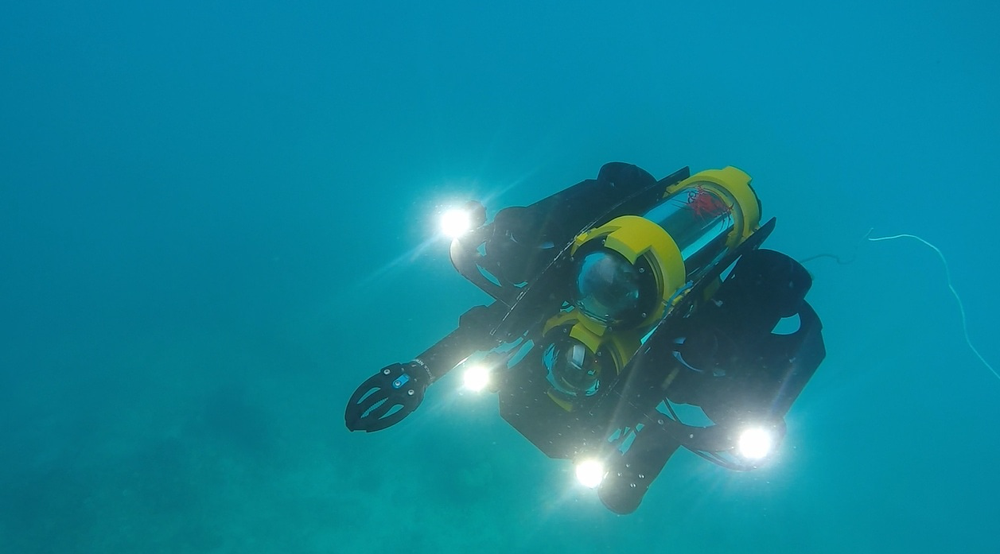
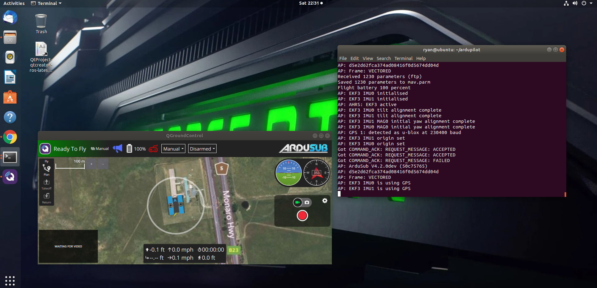
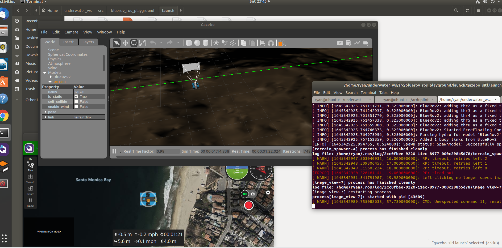

# AUV_objectDetection
Object tracking for mavros-based underwater robot using Hough transform 
===================

A package to simulate underwater vehicles.

<p align="center">
  
</p>


## Getting Started

### Requirements ###
- git
- [ros-\*-desktop-full](http://wiki.ros.org/ROS/Installation)
  - kinetic or newer
- [mavros](http://wiki.ros.org/mavros)
- python
  - opencv_python
  - numpy
  - [gi, gobject](https://wiki.ubuntu.com/Novacut/GStreamer1.0)
  - PyYAML
- [freefloating_gazebo](https://github.com/freefloating-gazebo/freefloating_gazebo)


### Install SITL Ardupilot package
```bash
git clone https://github.com/your-github-userid/ardupilot
cd ardupilot
git submodule update --init --recursive
cd ardupilot/
#try to run SITL and run qgcontrol
./Tools/autotest/sim_vehicle.py -v ArduSub --console
```
<p align="center">
  
</p>

### Running ArduSub SITL with Gazebo
To run ArduSub SITL with Gazebo, things to do:


1. Gazebo 
```bash
curl -sSL http://get.gazebosim.org | sh
gazebo
exit
```

2. Install freebuoyancy_gazebo plugin for buoyancy simulation.
```bash
git clone https://github.com/bluerobotics/freebuoyancy_gazebo
cd freebuoyancy_gazebo
mkdir build
cd build
cmake ..
make
sudo make install
```

3.Install ardupilot_gazebo/add_link plugin for ardupilot-gazebo communication
```bash
git clone https://github.com/patrickelectric/ardupilot_gazebo
cd ardupilot_gazebo
git checkout add_link
mkdir build
cd build
cmake ..
make -j4
sudo make install
echo 'source /usr/share/gazebo/setup.sh' >> ~/.bashrc
echo 'export GAZEBO_MODEL_PATH=~/ardupilot_gazebo/models' >> ~/.bashrc
echo 'export GAZEBO_RESOURCE_PATH=~/ardupilot_gazebo/worlds:${GAZEBO_RESOURCE_PATH}' >> ~/.bashrc
source ~/.bashrc
```

4.Run BlueRov2 Gazebo model


Download bluerov_ros_playground to your ROS workspace
```bash
cd ros_workspace_path/src
git clone https://github.com/patrickelectric/bluerov_ros_playground
cd ..
catkin_make
source devel/setup.sh
source gazebo.sh
```

Download a Gazebo plugin to simulate and control underwater vehicles to your ROS workspace
```bash
cd ros_workspace_path/src
git clone https://github.com/freefloating-gazebo/freefloating_gazebo.git
git clone https://github.com/freefloating-gazebo/freefloating_gazebo_demo.git
cd ..
catkin_make
source devel/setup.sh
```


### Test it
Open 3 terminal and open QGrouncontrol

1st terminal
```bash
cd ardupilot
./Tools/autotest/sim_vehicle.py -v ArduSub --console
```
2nst terminal
```bash
roscore
```
3rd terminal
```bash
cd ros_workspace_path/
source devel/setup.sh
roslaunch bluerov_ros_playground gazebo_sitl.launch
```

<p align="center">
  
</p>


## Troubleshooting

-If you are running gazebo7, probably you'll find a [bug in the GAZEBO_PLUGIN_PATH env variable](https://github.com/ros-infrastructure/reprepro-updater/issues/41).
To solve that issue, it's necessary to move all plugins to the correct path.
-Make sure to input correct IP address for SITL


## References

[freefloating_gazebo](https://github.com/freefloating-gazebo/freefloating_gazebo)
[ardupilot_gazebo](https://github.com/patrickelectric/ardupilot_gazeboo)
[Blurov-gazebo](https://github.com/patrickelectric/bluerov_ros_playground/blob/master/README.md)
[freefloating_gazebo](https://github.com/freefloating-gazebo/freefloating_gazebo)
